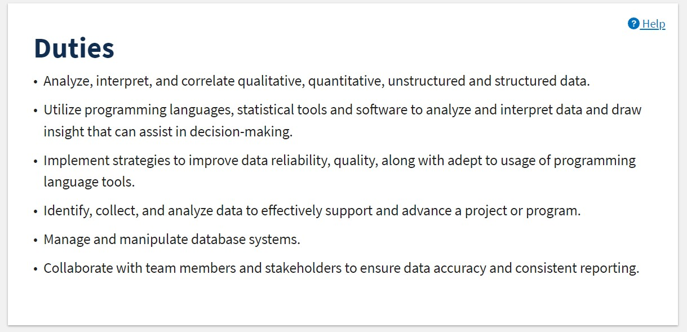
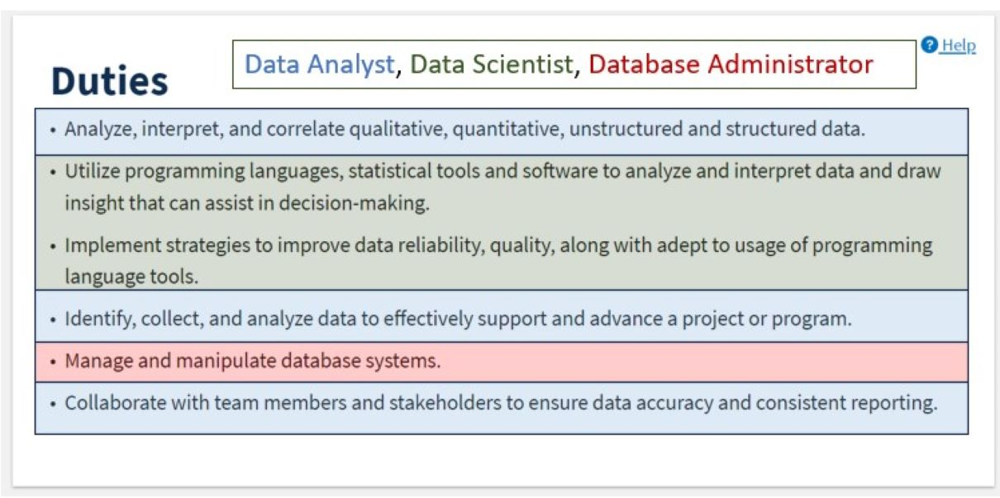
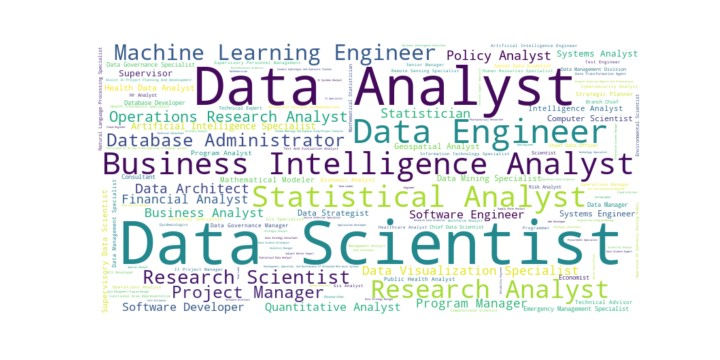

# What Job Is This Anyway? 
## Using LLMs to Classify USAJobs Data Scientist Listings

Author: Abigail Haddad
Date: October 19, 2023

---

# Problem: Difficult to Find Data Scientist Jobs

# Solution: Granular Labeling

1. We can use LLMs.
2. This can help job seekers.
3. And enable internal government analysis and changes.

---

---

# A detour to discuss classification problems

---

# Assessing classification problems

## Confusion Matrix

|                   | **Predicted Not Spam** | **Predicted Spam** |
|-------------------|------------------------|--------------------|
| **Actual Not Spam** | 479                    | 27                 |
| **Actual Spam**     | 24                     | 470                |

---

# Assessing classification problems

## Derivative metrics

| **Metric**                            | **Value** |
|---------------------------------------|-----------|
| Recall (True Positive Rate)           | 95%    |
| Specificity (True Negative Rate)      | 94%    |
| Precision (Positive Predictive Value) | 94%    |
| NPV (Negative Predictive Value)       | 95%    |

---

# 

# Back to USAJobs Listings

---

# Example 'Duties' Text

---

# Example 'Duties' Text with Highlights

---

## **We can't overcome text ambiguity problems with LLMs. If the information isn't there, it's not there.**

---

# My MVP Project Workflow

1. Pulled 843 1560 Data Scientist job listings.
2. Dropped those with no duty list via length/keyword filter.
3. Multi-label classification via GPT-3.5
3a. Assess consistency scores/inter-rater reliability
4. Analysis of results
4a. BERT encoding of labels, clustering.
4b. GPT labels of clusters
4c. Word cloud
4d. Ad hoc validation of results

---

# What can we actually get from this?

&nbsp;

&nbsp;

&nbsp;

&nbsp;

&nbsp;

----

# What can we actually get from this?

* A view of the variety of different roles that are under 1560
* A prototype job labeling system for applicants
* A way to highlight jobs that might be mislabeled or challenging to hire for
* A variable that might be predictive for research and analysis

# What this can't be

* The one (or more) "true" label
* A solution to ambiguous duties sections

----

# Big range of job title labels! 

&nbsp;

&nbsp;

&nbsp;

&nbsp;

&nbsp;

&nbsp;

&nbsp;

&nbsp;

&nbsp;

&nbsp;

---

| Cluster                              | %  | Top 5 Titles                                                                                           |
|--------------------------------------|----|--------------------------------------------------------------------------------------------------------|
| Data & Project Management            | 34 | Data Scientist, Project Manager, Data Analyst, Program Manager, Supervisor                           |
| Core Data Science & Engineering      | 22 | Data Scientist, Data Analyst, Machine Learning Engineer, Data Engineer, Statistical Analyst       |
| Data Science & Research              | 17 | Data Scientist, Data Analyst, Research Scientist, Data Engineer, Database Administrator               |
| Data Strategy & Specialization       | 16 | Data Analyst, Data Strategist, Geospatial Analyst, Supervisory Data Scientist, Chief Data Scientist  |
| Data Analysis & Research Intelligence| 10 | Data Analyst, Data Scientist, Business Intelligence Analyst, Statistical Analyst, Research Analyst |

---

# Spot Checking Title Sets

---

# Data Scientist, Data Analyst, Software Engineer

---
# 
# 
#
#
#
#
# Data Scientist, Data Analyst, Business Intelligence Analyst, Machine Learning Engineer, Artificial Intelligence Specialist, Data Engineer

---

# 
#

# Data Analyst, Data Architect, Data Scientist, Data Manager

---

What's better than ad hoc assessment? 

**Systematic assessment!**

---

# Derivative Metrics Revisited

| Metric Name     | Acronym | Definition |
|-----------------|---------|------------|
| Recall          | TPR     | The percentage of actual positives that the model correctly identified. |
| Specificity     | TNR     | The percentage of actual negatives that the model correctly identified. |
| Precision       | PPV     | Out of all the instances labeled as positives by the model, the percentage that are actual positives. |
| Negative Predictive Value | NPV | Out of all the instances labeled as negatives by the model, the percentage that are actual negatives. |

---

# Assessment Example with Synthetic Data

| Label            | TPR (Recall) | TNR (Specificity) | PPV (Precision) | NPV |
|------------------|--------------|-------------------|-----------------|-----|
| Data Scientist   | 23%         | 90%               | 26%             | 88% |
| Project Manager  | 33%         | 91%               | 35%             | 90% |
| Data Analyst     | 32%         | 90%               | 33%             | 90% |
| Program Manager  | 24%         | 90%               | 25%             | 90% |
| Supervisor       | 28%         | 90%               | 27%             | 90% |

---

Where To Go From Here?

* I would like federal job seekers to be able to more easily find jobs
* If you're trying to analyze or understanding this data, please use my code
* If you are interested in classificiation, especially via LLMs, I hope this will be useful

