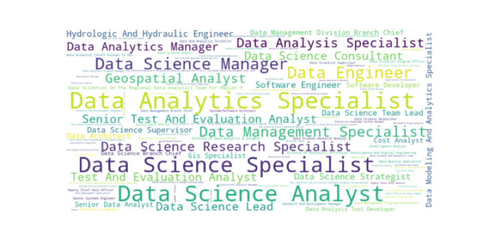

# What Job Is This Anyway?

## Using LLMs to Classify USAJobs Data Scientist Listings

Author: Abigail Haddad Date: October 19, 2023

------------------------------------------------------------------------

# I'm a data scientist, not a {data analyst, business intelligence analyst, software engineer, program manager}

# 

# 

------------------------------------------------------------------------

# I'm a data scientist, not a {data analyst, business intelligence analyst, software engineer}

# Solution: Text Classification

1.  We can use LLMs.
2.  This can help job seekers....
3.  ..and enable internal government analysis and changes.

------------------------------------------------------------------------

------------------------------------------------------------------------

# A detour to discuss classification problems

------------------------------------------------------------------------

# Assessing classification problems

## Confusion Matrix

|                     | **Predicted Not Spam** | **Predicted Spam** |
|---------------------|------------------------|--------------------|
| **Actual Not Spam** | 479                    | 27                 |
| **Actual Spam**     | 24                     | 470                |

------------------------------------------------------------------------

# Back to USAJobs Listings

------------------------------------------------------------------------

# Example 'Duties' Text

------------------------------------------------------------------------

# This position is officially titled "Data Scientist"

* My model accurately identified it "Data Engineer"
* Also, this position is misclassified! 🚫🚫🚫
* This is the kind of analysis we can do with this model

------------------------------------------------------------------------

## **We can't overcome text ambiguity problems with LLMs. If the information isn't there, it's not there.**

------------------------------------------------------------------------

# I'm not going to say who did this

------------------------------------------------------------------------

# My MVP Project Workflow

1.  Pulled ~850 1560 Data Scientist job listings.
2.  Dropped those with no duty list via length/keyword filter.
3.  Used the Marvin library to get structured output from GPT 3.5 for several problems, including the multi-class classification problem.
4. Ad hoc analysis, iteration

------------------------------------------------------------------------

# The only (Python) code you need

## Or why you should use Marvin (even if you're working in R)

------------------------------------------------------------------------

# What can we actually get from this?

-   A view of the variety of different roles that are under 1560
-   A prototype job labeling system for applicants
-   A way to highlight jobs that might be mislabeled, challenging to hire for, or misclassified
-   A variable that might be predictive for research and analysis

This is not the one "true" label 🥇 

------------------------------------------------------------------------

# What Did We Get? 

1. Overall differences in top titles
2. Job titles that never appear in the official title field
3. Spot checks

------------------------------------------------------------------------

### Comparing Top 10 Job Titles -- LLM vs. Official
#

------------------------------------------------------------------------

###
# New Job Titles

### Some of these are descriptive 🌟🌟🌟

------------------------------------------------------------------------

# Examples of big title discrepencies

---

## Generated Title: Data Analyst

---

## Generated Title: Technical Program Manager

----

What's better than ad hoc assessment?

**🎉 Systematic assessment! 🎉**

------------------------------------------------------------------------

# I tried a lot of other things, too

* Named entity recognition for finding tools and software 🚀 
* Grouping by category (BI intelligence, management, etc.) 🤷‍♂️
* Comparing actual titles and generated titles 👎 

------------------------------------------------------------------------

# What's next?

-   If you're a federal job seeker or researcher/analyst, let's talk!
-   If you have a text classification problem you might like LLMs (and Marvin)
